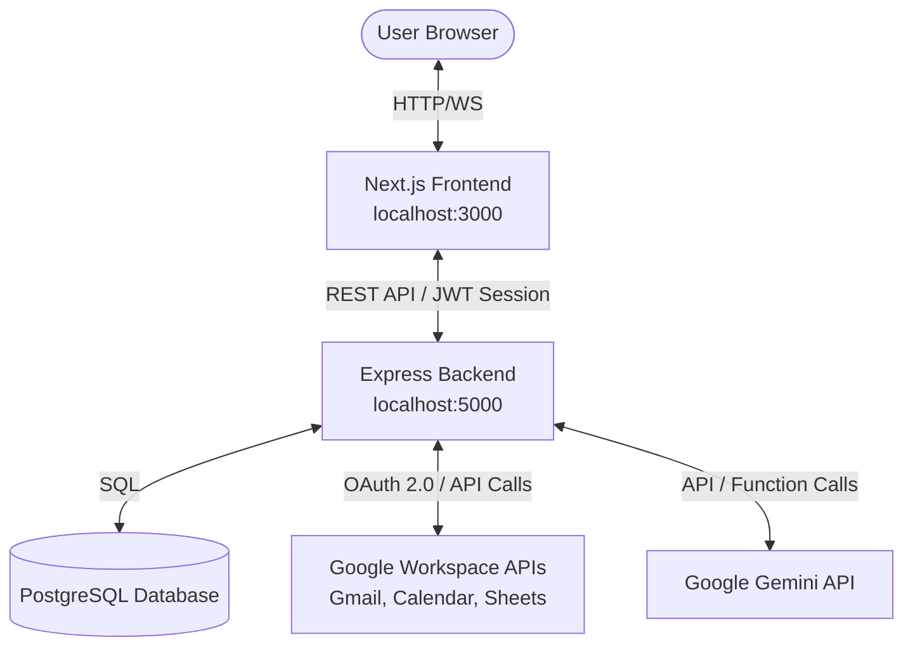

# JARVIS AI - Google Workspace Personal Assistant Mainframe

JARVIS AI is a production-ready personal AI assistant designed to manage your Google Workspace (Gmail, Calendar, Sheets) securely. Featuring a futuristic, glassmorphic Stark-inspired user interface with rich animations and a highly optimized modular Express backend.

---

## 🚀 System Architecture Overview



### Key Technical Patterns Deployed:
1. **Security & Cryptography**: All OAuth tokens are encrypted using **AES-256-GCM** via the `crypto` library prior to persistence in the database.
2. **Database Fallback Pattern**: The backend dynamically detects database availability. If PostgreSQL is offline or a URL is not provided, it automatically falls back to an embedded **SQLite** database, creating the schema and index structures automatically on startup.
3. **AI Function Calling Loop**: Gemini evaluates messages and requests function/tool invocations (e.g. `read_emails`, `create_calendar_event`, `append_sheet`). The backend routes these tool triggers to the Google APIs client, retrieves the results, feeds them back to Gemini, and streams the final response to the user via **Server-Sent Events (SSE)**.
4. **Holographic Particle HUD**: An interactive canvas-based animation rendering constellation particles linking nodes to the user's cursor at 60FPS with zero third-party packages.

---

## 📂 Project Structure

```
jarvis-ai/
├── backend/
│   ├── src/
│   │   ├── config/          # Configurations
│   │   ├── controllers/     # Route Controllers (Auth, Chat, Workspace, Automations)
│   │   ├── middleware/      # Middlewares (Auth, ErrorHandler)
│   │   ├── routes/          # REST Router (api.ts)
│   │   ├── services/        # Business Logic (GoogleAuth, Gmail, Calendar, Sheets, Gemini, Encryption, Database, Automation)
│   │   ├── tools/           # AI Function Calling Declarations (workspaceTools.ts)
│   │   └── index.ts         # Bootstrapping Entrypoint
│   ├── tsconfig.json
│   ├── package.json
│   └── .env
└── frontend/
    ├── src/
    │   ├── app/             # Next.js App Router (Layout, Page, CSS, Redirect Route)
    │   ├── components/      # UI components (Sidebar, Navbar, GlassCard, CommandPalette)
    │   │   └── views/       # Sub-Views (Dashboard, Chat, Gmail, Calendar, Sheets, Automation, Activity, Settings, Tasks, Notes)
    │   ├── context/         # Contexts (AuthContext)
    │   └── utils/           # API wrapper (api.ts)
    ├── tailwind.config.js
    ├── postcss.config.js
    ├── tsconfig.json
    └── package.json
```

---

## 🛠️ Environment Variables Configuration

Place the following configuration keys in `backend/.env`. The file has been pre-configured with the Google Client credentials:

```env
PORT=5000
NODE_ENV=development

# Leave blank to trigger SQLite automatic fallback:
DATABASE_URL=

JWT_SECRET=YOUR_JWT_SECRET
ENCRYPTION_KEY=YOUR_ENCRYPTION_KEY

# Pre-populated Client credentials
GEMINI_API_KEY=YOUR_GEMINI_API_KEY
GOOGLE_CLIENT_ID=YOUR_GOOGLE_CLIENT_ID
GOOGLE_CLIENT_SECRET=YOUR_GOOGLE_CLIENT_SECRET
GOOGLE_REDIRECT_URI=http://localhost:3000/api/auth/callback/google
FRONTEND_URL=http://localhost:3000
DEFAULT_SPREADSHEET_ID=YOUR_SPREADSHEET_ID
```

---

## 💾 Database Schema

The database compiles matching schemas:
- **`users`**: Registers user emails and JSON preferences.
- **`oauth_credentials`**: Encrypted access/refresh tokens.
- **`conversations`**: Chat thread records.
- **`messages`**: Dialogue history.
- **`automations`**: Scheduled cron workflows.
- **`automation_logs`**: Durations, statuses, and outputs.
- **`activity_logs`**: Unified logs showing AI operations.

---

## 🤖 Registered AI Tools (Function Calling)

Gemini has access to these declarations:
1. **`read_emails`**: Summarizes Gmail inbox content.
2. **`send_email`**: Dispatches HTML emails to recipients.
3. **`archive_email`**: Archives threads.
4. **`delete_email`**: Trashes messages.
5. **`summarize_email`**: Fetches full email body for AI summaries.
6. **`list_events`**: Lists Calendar schedules.
7. **`create_calendar_event`**: books event blocks on the calendar.
8. **`delete_calendar_event`**: Removes meetings.
9. **`create_sheet`**: Initializes new spreadsheets.
10. **`append_sheet`**: Appends tabular data rows.
11. **`read_sheet_data`**: Reads specific sheet cells range.

---

## ⚡ Deployment & Running Instructions

Open two separate terminal instances in the project folder:

### Start the Backend Server:
```bash
cd backend
npm install
npm run build
npm start   # Runs on http://localhost:5000
```

### Start the Next.js Frontend:
```bash
cd frontend
npm install
npm run build
npm start   # Runs on http://localhost:3000
```

Open `http://localhost:3000` in your web browser. Click **Connect Workspace**, authorize your Google Account, and witness the JARVIS AI mainframe come online!
